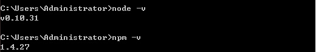

# 部署开发环境


### 安装nodejs

去[官网](https://nodejs.org/en/)下载安装，*可以安装当前最新版本*。

命令行运行以下命令查看是否安装成功：




### 全局安装gulp

````
$ npm install -g gulp
````

### 全局安装requirejs

打包压缩资源文件的时候要用上，只是开发可以不用安装。

````
$ npm install -g requirejs
````


### 选择开发工具

很多种开发工具，你要使用记事本我也没意见啦。推荐使用`sublime text 3`，因为开发过程`css`使用`sass`，所以需要安装`sass`的插件，可以先安装`package control`，然后安装`sass`。如果不清楚请查阅[sublime text 3官网](http://www.sublimetext.com/3)。


### 安装项目依赖

在项目根目录打开命令行(windows用户可以按住`Shift`键，选择项目文件夹，点击鼠标右键，选择“在此处打开命令行窗口”)，安装`package.json`里面的依赖模块。
````
$ npm install
````


### 可以开始了

开启一个本地服务，配合浏览器进行开发。
````
$ gulp watch
````

*如果是因为监听端口被占用报错，请修改`gulpfile.js`里面的监听端口。*
